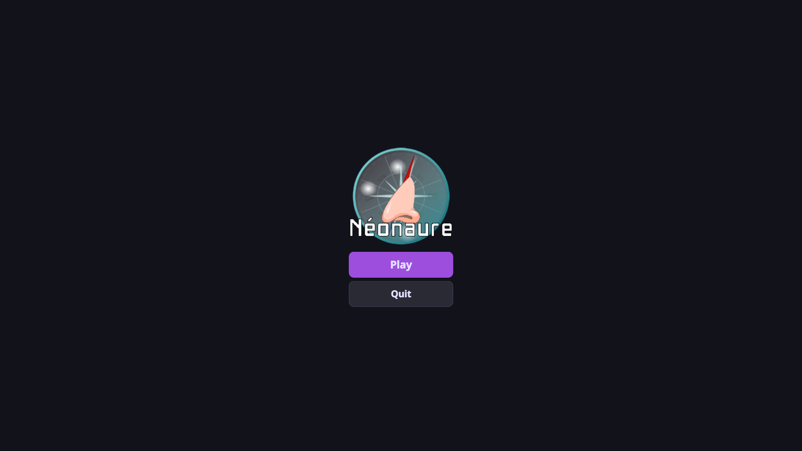
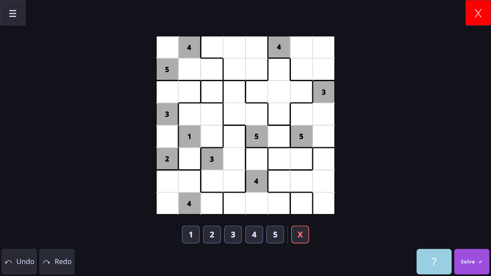

<h1 align="center">SAÉ Graphes-IHM — Néonaure</h1>

<p align="center">
  <a href="#français">🇫🇷 Français</a> | <a href="#english">🇬🇧 English</a>
</p>

---

## Français

### Présentation

Le **Néonaure** est inspiré du Sudoku joué généralement sur une grille 8x8 (64 cases) soumise à plusieurs contraintes:

- Un chiffre par case
- Un chiffre doit être entouré de chiffres différents (y compris en diagonale)
- Un motif de N cases (repéré en traits gras) doit comporter tous les chiffres de 1 à N

### Aperçu du jeu

Voici quelques aperçus de l'interface de l'application :

#### Menu Principal
<p align="center">
  
</p>

#### Jeu Lancé
<p align="center">
  
</p>

### Fonctionnalité de l'application

#### Jeu & Gameplay
- **Menu d'accueil interactif** : Permet de lancer une partie, de configurer ou de quitter proprement l'application.
- **Grille interactive** : Saisie et modification intuitive des chiffres dans la grille de jeu, avec distinction visuelle claire entre les chiffres de départ (lecture seule) et ceux saisis par le joueur.
- **Système de Drag & Drop** : Placement et déplacement des chiffres sur la grille de manière fluide et intuitive grâce au glisser-déposer.
- **Détection d'erreurs en temps réel** : Surlignage visuel (rouge) des cases en conflit(cases adjacentes identiques) ou de motifs.
- **Historique complet (Undo / Redo)** : Possibilité d'annuler (`Ctrl+Z`) ou de rétablir (`Ctrl+Y`) toutes vos actions à tout moment.
- **Générateur de grilles personnalisé** : Permet de concevoir des grilles sur mesure en spécifiant le nombre de lignes (de 4 à 12), de colonnes (de 4 à 12) et le pourcentage de cases initialement dévoilées.
- **Chargement & Sauvegarde** : Exportez vos grilles ou chargez-en de nouvelles au format JSON (`Ctrl+S` / `Ctrl+L`).

#### Intelligence Artificielle & Aide
- **Solveur automatique** : Résolution complète et instantanée de la grille de jeu à l'aide d'un algorithme de backtracking.
- **Système d'indices (Hint)** : Aide ponctuelle via le bouton d'indice (ampoule) qui révèle une case correcte, avec un système de temps de recharge (cooldown) de 60 secondes pour préserver le défi.

#### Paramètres & Compatibilité
- **Panneau latéral de paramètres** : Menu glissant et animé donnant accès aux réglages de l'application.
- **Profil utilisateur** : Personnalisation et enregistrement d'un pseudonyme affiché à l'écran de jeu.
- **Options d'affichage** : Activation/désactivation de l'affichage du chronomètre de jeu.
- **Règles intégrées** : Accès rapide aux règles détaillées du Néonaure directement dans l'interface.
- **Support Android** : Adaptation pour une utilisation sur appareils Android afin de profiter du jeu sur mobile.

### Dépendances & Prérequis

Le projet a été développé en Python et utilise les bibliothèques suivantes :

- **PyQt6** : Pour l'interface graphique du jeu.
- **NumPy** : Pour la manipulation de leur logique.

Vous pouvez installer les dépendances nécessaires à l'aide de la commande suivante :

```bash
pip install PyQt6 numpy
```

### Architecture — MVC

**Architecture approximative**

```
Neonaure
├── assets
│   └── misc
│       └── images
│           ├── iutlittoral-logo.png
│           ├── jeu.png
│           ├── Logo_Université_du_Littoral_Côte_d'Opale.png
│           ├── logo-neonaur.png
│           └── menu.png
├── controller
│   ├── controller.py
│   └── __init__.py
├── examples
│   ├── grille1.json
│   ├── grille2.json
│   ├── grille3.json
│   ├── grille4.json
│   ├── grille5.json
│   ├── grille6.json
│   ├── grille7.json
│   ├── grille8.json
│   └── grille9.json
├── model
│   ├── Cell.py
│   ├── Grid_Generator.py
│   ├── Grid.py
│   ├── __init__.py
│   ├── Pattern.py
│   └── solveur.py
├── tools
│   └── json_handler.py
├── view
│   ├── components
│   │   ├── cell_widget.py
│   │   ├── grid_widget.py
│   │   └── number_palette.py
│   ├── __init__.py
│   ├── main_window.py
│   ├── menu_window.py
│   └── settings_window.py
├── .gitignore
├── main.py
└── README.md

```

### Équipe

| Nom       | Prénom | Groupe TP |
| :-------- | :----: | --------: |
| DELPLACE  |  Hugo  |         E |
| DUFOUR    | Arthur |         E |
| MORMENTYN |  Noa   |         D |


<br>
<hr style="border: none; height: 1px; background-color: red; border-top: 1px solid red;">

<p align="center">
  
  
</p>

---

## English

### Presentation

The **Néonaure** is inspired by Sudoku, usually played on an 8x8 grid (64 cells) subject to several constraints:

- One number per cell
- A number must be surrounded by different numbers (including diagonally)
- A pattern of N cells (marked by bold lines) must contain all numbers from 1 to N

### Game Preview

Here are some previews of the application interface:

#### Main Menu
<p align="center">
  
</p>

#### Game in Progress
<p align="center">
  
</p>

### Application Features

#### Game & Gameplay
- **Interactive home menu**: Allows you to launch a game, configure or properly quit the application.
- **Interactive grid**: Intuitive entry and modification of numbers in the game grid, with a clear visual distinction between starting numbers (read-only) and those entered by the player.
- **Drag & Drop System**: Smooth and intuitive placement and movement of numbers on the grid using drag-and-drop.
- **Real-time error detection**: Visual highlighting (red) of conflicting cells (identical adjacent cells) or patterns.
- **Complete History (Undo / Redo)**: Ability to undo (`Ctrl+Z`) or redo (`Ctrl+Y`) all your actions at any time.
- **Custom grid generator**: Allows you to design custom grids by specifying the number of rows (from 4 to 12), columns (from 4 to 12) and the percentage of initially revealed cells.
- **Loading & Saving**: Export your grids or load new ones in JSON format (`Ctrl+S` / `Ctrl+L`).

#### Artificial Intelligence & Help
- **Automatic solver**: Complete and instantaneous resolution of the game grid using a backtracking algorithm.
- **Hint system**: Occasional help via the hint button (lightbulb) that reveals a correct cell, with a 60-second cooldown system to preserve the challenge.

#### Settings & Compatibility
- **Side settings panel**: Sliding and animated menu giving access to the application settings.
- **User profile**: Customization and saving of a nickname displayed on the game screen.
- **Display options**: Enable/disable the display of the game timer.
- **Integrated rules**: Quick access to the detailed rules of Néonaure directly in the interface.
- **Android Support**: Adaptation for use on Android devices to enjoy the game on mobile.

### Dependencies & Requirements

The project was developed in Python and uses the following libraries:

- **PyQt6**: For the graphical interface of the game.
- **NumPy**: For the manipulation of grids and logic.

You can install the necessary dependencies using the following command:

```bash
pip install PyQt6 numpy
```

### Architecture — MVC

**Approximate Architecture**

```
Neonaure
├── assets
│   └── misc
│       └── images
│           ├── iutlittoral-logo.png
│           ├── jeu.png
│           ├── Logo_Université_du_Littoral_Côte_d'Opale.png
│           ├── logo-neonaur.png
│           └── menu.png
├── controller
│   ├── controller.py
│   └── __init__.py
├── examples
│   ├── grille1.json
│   ├── grille2.json
│   ├── grille3.json
│   ├── grille4.json
│   ├── grille5.json
│   ├── grille6.json
│   ├── grille7.json
│   ├── grille8.json
│   └── grille9.json
├── model
│   ├── Cell.py
│   ├── Grid_Generator.py
│   ├── Grid.py
│   ├── __init__.py
│   ├── Pattern.py
│   └── solveur.py
├── tools
│   └── json_handler.py
├── view
│   ├── components
│   │   ├── cell_widget.py
│   │   ├── grid_widget.py
│   │   └── number_palette.py
│   ├── __init__.py
│   ├── main_window.py
│   ├── menu_window.py
│   └── settings_window.py
├── .gitignore
├── main.py
└── README.md

```

### Team

| Last Name | First Name | TP Group  |
| :-------- | :--------: | --------: |
| DELPLACE  |  Hugo      |         E |
| DUFOUR    | Arthur     |         E |
| MORMENTYN |  Noa       |         D |


<br>
<hr style="border: none; height: 1px; background-color: red; border-top: 1px solid red;">

<p align="center">
  
  
</p>
